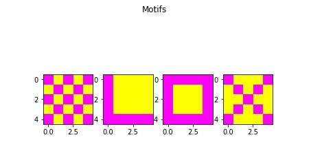
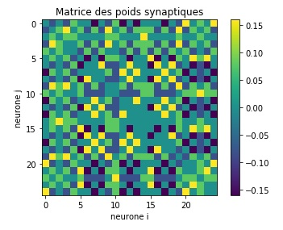
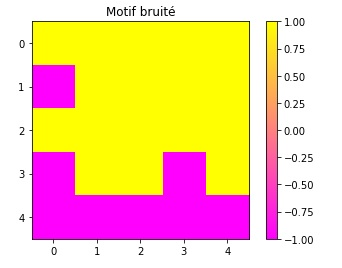
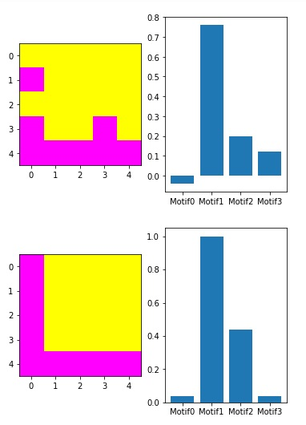

Programmation d'un réseau de Hopfield <a name="programmation-d-un-reseau-de-hopfield"></a>
===========================

Le but de ce projet est de créer un réseau de Hopfield qui reconnaît des stimuli visuels parmi les stimuli qu'il a stocké. Un réseau de Hopfield est donc une forme simple de mémoire associative, qui fonctionne en deux temps : 
1) Le réseau de neurones stocke un certain nombre de stimuli (phase d'apprentissage) ;
2) Le réseau tente de reconnaître le stimulus qu'on lui présente (phase de reconnaissance)

Dans ce projet, nous avons programmé des fonctions permettant de créer des stimuli, de stocker et reconnaître ces derniers, et d'afficher nos résultats sous forme graphique. Puis nous avons testé notre programme avec un réseau de Hopfield composé de 5x5 neurones et des stimuli aléatoires ou représentant des formes simples.

<!-- markdown-toc start - Don't edit this section. Run M-x markdown-toc-refresh-toc -->
**Table des matières**

- [Programmation d'un réseau de Hopfield](#programmation-d-un-reseau-de-hopfield)
    - [Création de stimuli visuels](#creation-de-stimuli-visuels)
        - [Formes déterminées](#formes-determinees)
        - [Motifs aléatoires](#motifs-aleatoires)
        - [Bruiter un motif](#bruiter-un-motif)
        - [Convertir des matrices en listes et inversement](#convertir)
    - [Programmation du réseau](#programmation-du-reseau)
        - [Matrice synaptique](#matrice-synaptique)
        - [Dynamique du réseau](#dynamique)
        - [Essai avec un réseau 5x5](#essai-avec-un-reseau-5x5)
    - [Conclusion](#conclusion)
    - [Références](#references)
    - [Remarques finales](#remarques)

<!-- markdown-toc end -->

## Création de stimuli visuels <a name="creation-de-stimuli-visuels"></a>

Les stimuli que nous allons stocker dans notre réseau se présentent sous forme de grilles bicolores. Les deux couleurs correspondent aux deux états possibles d'un neurone dans un réseau de Hopfield : -1 et 1. Nous avons donc programmé des fonctions permettant de créer des motifs de taille souhaitée, représentant des formes géométriques précises (un carré, une croix...) ou bien des formes aléatoires. Enfin, nous avons programmé une fonction permettant de bruiter un stimulus avant de le présenter à notre réseau. 

### Formes déterminées <a name="formes-determinees"></a>

Ici, nous montrons comment créer des stimuli représentant des formes déterminées de la taille souhaitée. Nous avons ainsi créé un motif en damier, un motif en L, un motif en croix et un motif en carré. Chaque motif est représenté dans une matrice.

  ```
  import numpy as np
  
#Cette fonction permet de créer un motif "damier" de la taille souhaitée

def checkerboard(size):
    pattern = np.zeros((size, size))
    for i in range(size):
        for j in range(size):
            if i%2==0:
                if j%2==0:
                    pattern[i][j]=-1
                else:
                    pattern[i][j]=1
            else:
                if j%2==0:
                    pattern[i][j]=1
                else:
                    pattern[i][j]=-1
    return pattern


#Cette fonction permet de créer un motif en L de la taille souhaitée

def lshaped(size):
    pattern = np.zeros((size, size))
    for i in range(size-1):
        for j in range(1):
            pattern[i][j]=-1
        for j in range(1, size):
            pattern[i][j]=1
    for i in range(size-1,size):
        for j in range(size):
            pattern[i][j]=-1   
    return pattern

#Cette fonction permet de créer un motif carré de la taille souhaitée

def square(size):
    pattern=np.zeros((size, size))
    for i in range(1):
        for j in range(size):
            pattern[i][j]=-1
    for i in range(1, size-1):
        for j in range(1):
            pattern[i][j]=-1
        for j in range(1,size-1):
            pattern[i][j]=1
        for j in range(size-1,size):
            pattern[i][j]=-1
    for i in range(size-1,size):
        for j in range(size):
            pattern[i][j]=-1
    return pattern

#Cette fonction permet de créer un motif en croix de la taille souhaitée

def cross(size):
    pattern=np.zeros((size, size))
    for i in range(size):
        for j in range(size):
            if (i==j) or (i+j==size-1):
                pattern[i][j]=-1
            else:
                pattern[i][j]=1
    return pattern
 ```
 
 ### Motifs aléatoires <a name="motifs-aleatoires"></a>
 
Nous avons aussi programmé une fonction permettant de créer un motif aléatoire de la taille souhaitée. Chaque motif aléatoire est composé de 50% de pixels d'état -1 et de 50% de pixels d'état 1 (pas tout à fait si le nombre de pixels est impair). 

```
import numpy as np
import random as rd

#Cette fonction permet de créer un motif aléatoire de la taille souhaitée

def randompattern(size):
    pattern=np.full((size, size), 1)
    L=[]
    a=0
    number=int((size**2)/2)
    while len(L)<number:
        x=rd.randint(0, size-1)
        y=rd.randint(0, size-1)
        if (x,y) in L:
            a=x
        else:
            L.append((x,y))
            pattern[x][y]=-1
    return pattern    
```

### Bruiter un motif <a name="bruiter-un-motif"></a>

Pour tester notre réseau de neurones, nous devrons lui présenter des motifs bruités. C'est pourquoi nous avons créé une fonction permettant de bruiter un motif en changeant l'état d'un nombre choisi de pixels. Si un pixel est dans l'état 1, le bruiter revient à le faire passer dans l'état -1, et inversement. 

```
import random as rd

#Cette fonction permet de bruiter un motif (d neurones sont bruités)

def noisy(pattern, d):
    L=[]
    a=0 #cette variable sert à ce qu'il ne se passe rien si le pixel sélectionné aléatoirement a déjà été bruité
    number=len(pattern[0])
    while len(L)<d:
        x=rd.randint(0, number-1)
        y=rd.randint(0, number-1)
        if (x,y) in L:
            a=x
        else:
            L.append((x,y))
            pattern[x][y]=-pattern[x][y]
    return pattern
```
### Convertir des matrices en listes et inversement <a name="convertir"></a>

Lorsque nous avons programmé notre réseau, nous nous sommes rendu compte qu'il était plus pratique, pour certaines fonctions, de travailler sur des stimuli mis sous forme de listes, et non sous forme de matrices. Nous avons donc créé deux fonctions permettant de convertir les listes en matrices et inversement. 

```
import numpy as np
import math

#Cette fonction permet de convertir une matrice en liste

def convert(matrix):
    number = len(matrix[0])
    c=0
    M=[0 for i in range(number**2)]
    for m in range(number):
        for n in range(number):
            M[c]=matrix[m][n]
            c=c+1
    return M
    
#Cette fonction permet de convertir une liste en matrice

def convert_lm(list):
    n=int(math.sqrt(len(list)))
    M=np.zeros((n,n))
    c=0
    for i in range(n):
        for j in range(n):
            M[i][j]=list[c]
            c=c+1
    return M
```

## Programmation du réseau <a name="programmation-du-reseau"></a>

Dans cette section, nous expliquons comment nous avons programmé notre réseau de Hopfield, et comment nous l'avons testé. Pour ce faire, nous précisons à quoi correspond la matrice des poids synaptiques, et comment la programmer. Puis nous présentons notre test avec un réseau de 5x5 neurones. 

### Matrice synaptique <a name="matrice-synaptique"></a>
 
Lors de la phase d'apprentissage, le réseau de Hopfield stocke les stimuli qu'on lui présente dans la matrice synaptique, dont chaque coefficient représente un poids synaptique <a href="https://www.codecogs.com/eqnedit.php?latex=w_{ij}" target="_blank"></a>. Ces poids synaptiques obéissent à la formule suivante :

<a href="https://www.codecogs.com/eqnedit.php?latex=$$w_{ij}&space;=&space;c\sum_{\mu=1}^{m}p_{i}^{\mu}p_{j}^{\mu}$$" target="_blank"></a>

où <a href="https://www.codecogs.com/eqnedit.php?latex=$\mu$" target="_blank"></a> désigne un stimulus, <a href="https://www.codecogs.com/eqnedit.php?latex=$m$" target="_blank"></a> le nombre de stimuli stockés, <a href="https://www.codecogs.com/eqnedit.php?latex=$c$" target="_blank"></a> l'inverse du nombre de neurones que contient le réseau et <a href="https://www.codecogs.com/eqnedit.php?latex=$p_{i}^{\mu}$" target="_blank"></a> l'état du pixel i dans le motif <a href="https://www.codecogs.com/eqnedit.php?latex=$\mu$" target="_blank"></a>. 

Nous avons créé une fonction prenant en argument une liste de stimuli et retournant la matrice des poids synaptiques. Attention : la liste de stimuli est au format d'une liste de listes, donc les stimuli qu'elle contient auront été convertis sous forme de listes auparavant.

```
import numpy as np

#Cette fonction crée une matrice des poids synaptiques à partir d'une liste de motifs de même taille

def SynapticWM(Patterns):
    number=len(Patterns[0])    
    SWM=np.zeros((number,number))
    for p in Patterns:
        for i in range(number):
            for j in range(number):
                SWM[i, j] += p[i] * p[j]
    SWM /= number
    np.fill_diagonal(SWM, 0)
    return SWM
    
```
### Dynamique du réseau <a name="dynamique"></a>

Le réseau de Hopfield est mis à jour selon la dynamique suivante :

<a href="https://www.codecogs.com/eqnedit.php?latex=$$h_{i}(t)=\sum_{j}{w_{ij}S_{j}(t)}$$" target="_blank"></a>

où <a href="https://www.codecogs.com/eqnedit.php?latex=$h_{i}(t)$" target="_blank"></a> est le champ local du neurone i à t. Dès lors, l'état du neurone i se met à jour selon la formule :

<a href="https://www.codecogs.com/eqnedit.php?latex=$$S_{i}(t&plus;\Delta&space;t)=&space;sign(h_{i}(t))$$" target="_blank"></a>

Enfin, nous avons testé notre programme sur un réseau de 5x5 neurones. Tout d'abord, nous avons créé quatre motifs 5x5 : un damier, un carré, une croix et un L.

```
import numpy as np
import matplotlib.pyplot as plt

#On crée quatre motifs de taille 5x5 grâce aux fonctions précédentes

Damier5=checkerboard(5)
MotifL5=lshaped(5)
Carre5=square(5)
Croix5=cross(5)

#On affiche les quatre motifs

fig, (ax0, ax1, ax2, ax3) = plt.subplots(1, 4)
matrix1 = Damier5
matrix2 = MotifL5
matrix3 = Carre5
matrix4 = Croix5
ax0.imshow(matrix1, cmap=plt.cm.spring)
ax1.imshow(matrix2, cmap=plt.cm.spring)
ax2.imshow(matrix3, cmap=plt.cm.spring)
ax3.imshow(matrix4, cmap=plt.cm.spring)
fig.suptitle('Motifs')
```



Puis on convertit ces motifs sous forme de liste, on les stocke dans une liste de motifs, et l'on affiche notre matrice synaptique :

```
import math
import numpy as np
import matplotlib.pyplot as plt 

#On convertit chaque motif sous forme de liste

Liste_Damier5=convert(Damier5)  
Liste_MotifL5=convert(MotifL5)  
Liste_Carre5=convert(Carre5)  
Liste_Croix5=convert(Croix5) 

#On crée une liste de motifs

Liste_Motifs=[Liste_Damier5, Liste_MotifL5, Liste_Carre5, Liste_Croix5]

#On calcule la matrice des poids synaptiques

Weights = SynapticWM(Liste_Motifs)

#On affiche la matrice des poids synaptiques

fig, ax = plt.subplots()
matrix = Weights
ax.imshow(matrix, cmap=plt.cm.viridis)
plt.title("Matrice des poids synaptiques")
plt.xlabel("neurone i")
plt.ylabel("neurone j")
cb = plt.colorbar(ax.imshow(matrix, cmap=plt.cm.viridis))
plt.show()

```


Ensuite, on bruite le motif en L : trois pixels aléatoires sont bruités.

```
import random as rd
import math
import matplotlib.pyplot as plt
import numpy as np

#On bruite notre motif en L

MotifL_Bruite=noisy(MotifL5, 3)

#On affiche notre motif bruité

fig, ax = plt.subplots()
matrix = MotifL_Bruite
ax.imshow(matrix, cmap=plt.cm.viridis)
plt.title("Motif bruité")
cb = plt.colorbar(ax.imshow(matrix, cmap=plt.cm.spring))
plt.show()
```


Enfin, on fait tourner la dynamique du réseau. Nous lui avons fait faire 5 étapes, mais le réseau reconnaît notre motif au bout de la deuxième étape.

```
import math
import matplotlib.pyplot as plt
import numpy as np
import random as rd

print(dynamics(MotifL_Bruite, Liste_Motifs, 5))
```


## Conclusion <a name="conclusion"></a>

Dans le cadre de ce projet, j'ai programmé des stimuli visuels ainsi qu'un réseau de Hopfield reconnaissant ces stimuli. Mon essai avec un réseau 5x5 et des stimuli représentant des formes simples a très bien fonctionné. Malheureusement, je n'ai pas eu le temps de tester certains paramètres comme la capacité de stockage du réseau, ou bien sa dynamique lorsque les motifs stockés sont fortement corrélés. Cependant, le programme que j'ai écrit me fournit une très bonne base pour tester ces paramètres. 

## Références <a name="references"></a>

Je me suis familiarisée avec les réseaux de Hopfield grâce à ce site : https://neuronaldynamics.epfl.ch/online/Ch17.S2.html 
Pour la rédaction du fichier README, je me suis inspirée du code de Christophe Pallier : https://github.com/chrplr/PCBS 

## Remarques finales <a name="remarques"></a>

En ce qui concerne mon niveau en programmation, j'ai suivi un cours d'initiation à Python en première année de classes préparatoires MPSI il y a trois ans.

Les notions que j'y ai apprises étaient plutôt abstraites, et ce cours m'a permis de les appliquer dans un cadre plus concret - celui des sciences cognitives. J'ai également appris à utiliser pygame, qui n'était pas au programme de la MPSI quand j'y ai étudié la programmation. 
